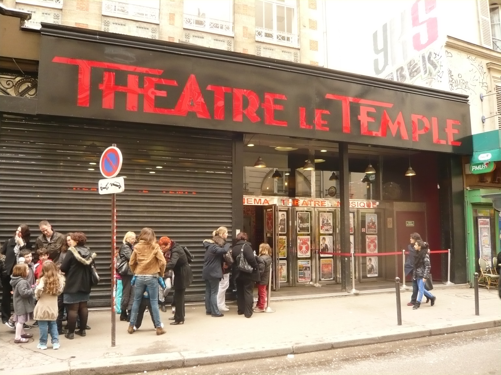

A cet emplacement fut fondée **en 1782** par **Philip Astley**, ancien sous-officier de la cavalerie britannique, et son associé **Antonio Franconi** le premier cirque permanent de Paris: **l’Amphithéâtre anglais**. On pouvait y voir des jeux équestres, des animaux dressés et des clowns. Après le départ d'**Astley en 1793**, **Franconi** lui succède, puis déménage **en 1801** pour fonder le **Cirque-Olympique**.

La salle brûle **en 1826** au cours d'un pantomime : 'L'incendie de Salins'.

**À partir de 1912**, un cinéma de 500 places le **"Consortium"** est créé. Il cède la place **en 1922** à un café concert dénommé **"Le Temple-Concert"**.

**Dès 1930**, un nouveau cinéma coexiste avec le théâtre sous le nom de **"Templia"**. Il se maintiendra jusqu'**en 2003**, date de sa disparition, sous le nom de l'**Action République**. On y projetait des œuvres d'art-et-essai et des courts métrages dans une salle unique de 350 places.
**Le théâtre Le Temple** réaménagé en 4 salles devient alors un plateau humoristique parisien, avec 8 à 10 spectacles par jour. Il a contribué à la découverte de nombreux artistes désormais reconnus : Omar & Fred, Clémentine Célarié, Jean-Luc Lemoine ou encore Tomer Sisley et Audrey Lamy, qui prennent plaisir à revenir se produire sur la scène de leur début. La programmation proposée est ainsi riche et variée, alternant artistes confirmés et jeunes talents.

**Le théâtre Le Temple** est devenu l’**Apollo Théâtre** **en décembre 2014**, le lieu axe sa programmation sur les Comédies, le One Man et Woman show. Une place importante est réservée à la découverte de nouveaux talents.

A Paris le **Théâtre Apollo** a été créé **en 1905**. La salle se trouvait 20 rue de Clichy à côté du Casino de Paris. C’était un lieu de création  d’opérettes et de pièces qui disposait de son  propre orchestre symphonique. Cette salle disparaitra après la guerre **en 1950**.

Aujourd’hui l’**Apollo Théâtre** renait au cœur de Paris, près de la place de la République. Cet endroit magique, dispose de quatre salles de spectacles de 90 à 360 places, climatisées, équipées des moyens techniques de gestion du spectacle vivant les plus sophistiqués.

