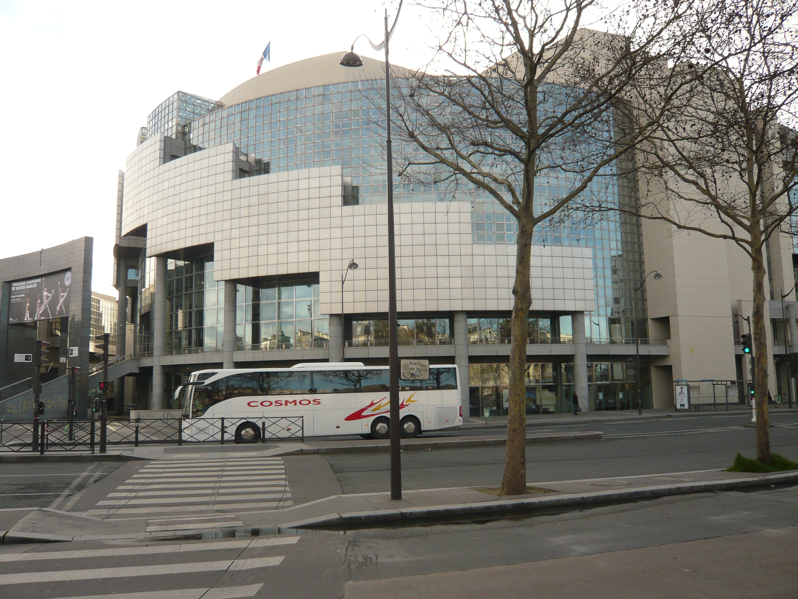

Le président **François Mitterrand** décide **en 1982** la construction d’un nouvel opéra dans Paris afin de décharger l’opéra Garnier. Il veut un opéra « moderne et populaire ». Pour les besoins de l’époque, on crée **en 1983** l'Établissement public Opéra-Bastille (EPOB).

L’emplacement de la gare de Paris-Bastille, situé entre la rue de Lyon et la rue de Charenton et au niveau de la place de la Bastille, est choisi. 

Les travaux débutent **en 1984** avec la démolition de la gare de Paris-Bastille, ouverte **en 1859** et fermée **le 14 décembre 1969**. Elle sert jusqu’à sa démolition pour des expositions diverses.

Elle a été conçue par **Carlos Ott** architecte uruguayen et canadien. 

L'**opéra Bastille** est inauguré **le 13 juillet 1989** pour les festivités du bicentenaire de la prise de la Bastille, avec un spectacle mis en scène par Bob Wilson, _La Nuit avant le jour_, mais les représentations régulières ne débutent que **le 17 mars 1990**, avec _Les Troyens de Berlioz_.

**En 1993**, l’Établissement public **Opéra-Bastille** (EPOB) est dissous. L’année suivante, l’Opéra Bastille devient Opéra de Paris et devient un établissement public à caractère industriel et commercial (EPIC). Les premières années de fonctionnement de la salle ont été marquées par des difficultés persistantes dans la gestion automatisée de la machinerie scénique, défaut fréquent des nouveaux théâtres qui a cependant occasionné plusieurs scandales à Paris. Des travaux réalisés sans fermeture du théâtre ont permis de parvenir à un fonctionnement satisfaisant de l’ensemble de l’équipement.

C’est avec l’**opéra Garnier** l’une des deux salles constituant l'**Opéra de Paris**.
