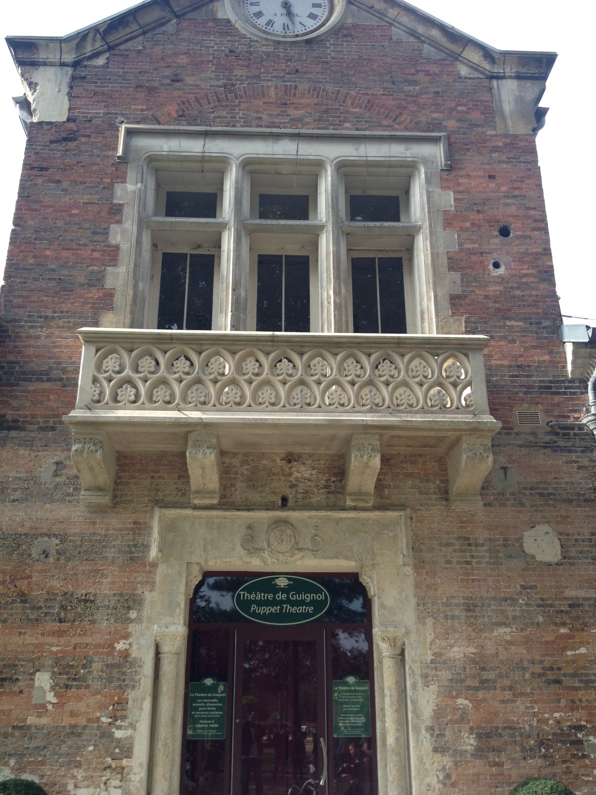

**_LE JARDIN_**

La transformation du Bois de Boulogne **en 1852** a engendré la création d'un jardin d'acclimatation à l'entrée du Bois à l'initiative de la Société impériale zoologique d'acclimatation, fondée **le 10 février 1854** par le zoologiste Isidore Geoffroy Saint-Hilaire. Cette société savante avait pour but de contribuer à l'introduction et à l'acclimatation d'espèces animales exotiques à des fins agricoles, commerciales ou de loisir.
**Le 26 mars 1858**, cette société obtient de la ville de Paris la concession d'un espace de quinze hectares à la bordure nord du bois de Boulogne pour y installer un « jardin d'agrément et d'exposition d'animaux utiles de tous pays ». Cette zone était en cours d'aménagement **depuis 1855**. La société confie **en juillet 1859** à l'architecte Gabriel Davioud et au paysagiste Jean-Pierre Barillet-Deschamps la poursuite des travaux. Dans le même temps, **le 25 août 1859**, elle obtient de **Napoléon III** la concession de quatre hectares supplémentaires. Le jardin est inauguré par **Napoléon III le 6 octobre 1860** après quinze mois de travaux. Dès son ouverture **le 9 octobre**, l'exotisme est bien présent : on trouve des ours, une girafe, des chameaux, des kangourous, des bananiers et des bambous. **En octobre 1861**, un aquarium y est ouvert.
**En 1866**, le jardin compte plus de 110 000 animaux. **En 1867** y sont exposés les 12 Bœufs Gras du Carnaval de Paris, dont 6 défileront dans le grand cortège de la promenade du Bœuf Gras.

Le **Théâtre du Jardin** compte 260 confortables fauteuils de velours rouge. Avec son plan en hémicycle, son plateau scénique spacieux et son grand écran de projection, c’est le lieu idéal pour vos conférences, assemblées générales, projections privées ou spectacles de Noël.

Grand, beau, confortable, le théâtre accueille désormais les amateurs de Guignol dans les grandes écuries Napoléon III récemment rénovées.
Après avoir fêté, **en juin 2008**, le bicentenaire de la célèbre figurine lyonnaise en rassemblant 15 troupes de marionnettistes venus des quatre coins de la capitale et de la France entière, il était normal que le Jardin lui donne une maison à sa taille et à sa gloire, en un mot qu’il conçoive le plus beau **théâtre de Guignol** de Paris.
