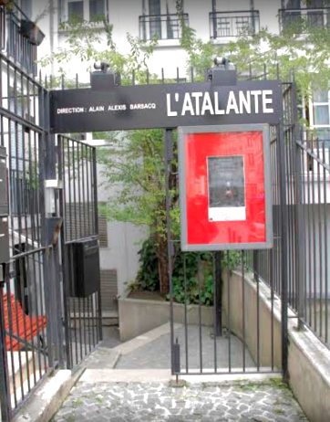

_Dans la mythologie grecque, Atalante est une héroïne. Deux traditions existent à son sujet dans la mythologie grecque, toutes les deux mettant l'accent sur son refus initial du mariage et des performances physiques hors du commun pour une femme. Atalante a régulièrement inspiré les artistes depuis l'Antiquité jusqu'à l'époque actuelle._

**De 1977 à 1991 Agathe Alexis** fonde et codirige avec **Alain Alexis Barsacq** la Compagnie des Matinaux.

**En 1984**, à l’instigation d’**Alain Alexis Barsacq**, **l’Atalante**, théâtre d’essai situé dans les sous-sols du Théâtre de l’Atelier, est créé.

Il est géré **de 1984 à 1991** par un collectif de metteurs en scène composé d’**Alain Alexis Barsacq, Agathe Alexis et Christian Schiaretti**.

**De janvier 1992 à juin 2004 Agathe Alexis** codirige avec **Alain Alexis Barsacq** la Comédie de Béthune, centre dramatique national du Nord-Pas-de-Calais.

**En juin 2004**, elle fonde la Compagnie Agathe Alexis.

