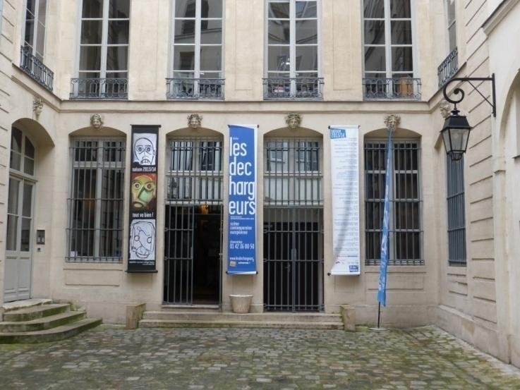

Le bâtiment qui abrite le théâtre **Les Déchargeurs** a été construit **en 1708** par **Marie Orceau** , veuve **Rouillé** , membre de la richissime famille **Pajot et Rouillé**. Les **Pajot et Rouillé** étaient les propriétaires de la  [Poste](https://fr.wikipedia.org/wiki/Poste), entreprise privée à l&#39;époque, et qui se trouvait à quelques mètres au 9 rue des Déchargeurs dans l&#39; [hôtel de Villeroy/hôtel de la Poste](https://fr.wikipedia.org/wiki/H%C3%B4tel_de_Villeroy_(Paris,_1er_arrondissement)).

Le bâtiment qui l&#39;accueille est inscrit aux  [monuments historiques](https://fr.wikipedia.org/wiki/Monument_historique_(France)): par des  [arrêtés](https://fr.wikipedia.org/wiki/Arr%C3%AAt%C3%A9_en_France) du  [**12**](https://fr.wikipedia.org/wiki/12_f%C3%A9vrier) [**février**](https://fr.wikipedia.org/wiki/F%C3%A9vrier_1925) [**1925**](https://fr.wikipedia.org/wiki/1925) pour les  [façades](https://fr.wikipedia.org/wiki/Fa%C3%A7ade_(architecture)) sur rue et sur cours, et du  [**4**](https://fr.wikipedia.org/wiki/4_octobre) [**octobre**](https://fr.wikipedia.org/wiki/Octobre_2001) [**2001**](https://fr.wikipedia.org/wiki/2001) pour les  [toitures](https://fr.wikipedia.org/wiki/Toit) sur rue et sur cours, ainsi que l&#39; [escalier](https://fr.wikipedia.org/wiki/Escalier) monumental et sa cage du XVIIIe siècle situés dans la cour principale à l&#39;extrémité de l&#39;aile de gauche en entrant.

Le théâtre  **Les Déchargeurs**  habite l&#39;âme de cet hôtel particulier du XVIIe siècle qu&#39;un lourd portail en chêne protège de la rumeur urbaine. Les textes et les voix y ont trouvé leur demeure, et le silence, des complices pour les envoûter.

**En 1979** , une troupe d&#39;amis comédiens, architecte, peintre, à la tête de laquelle  **Vicky Messica**  poète-comédien, Chevalier de l&#39;Ordre des Arts et des Lettres, se donne rendez-vous au 3 rue des déchargeurs dans le 1er arrondissement de Paris.

Dans ce lieu aurait officié l&#39;alchimiste Nicolas Flamel, intervenait le premier écrivain public spécialisé en billets doux (premier relais des Petites postes). Autrefois hôtel particulier du premier directeur de l&#39;Opéra de Paris ou encore coursive des Halles, ce bâtiment abrite  **depuis septembre 1982** le théâtre **Les Déchargeurs**.

**Vicky Messica** fonde le lieu pour la poésie, pour l&#39;écriture contemporaine. Il désire un théâtre à hauteur d&#39;Homme, place l&#39;accueil, l&#39;échange et la transmission au centre de son projet.
Bien qu&#39;il eut la possibilité à plusieurs reprises, et ce dès le début des travaux, de créer une salle d&#39;une capacité d&#39;accueil plus importante (Salle Vicky Messica - capacité de 80 places), il préféra offrir au théâtre un bar et un hall d&#39;accueil afin de favoriser les rencontres, l&#39;échange entre les spectateurs et les acteurs du spectacle vivant, mais offrir également un espace d&#39;exposition aux artistes (peintre, sculpture, photographe, vidéaste).
Dix ans après l&#39;ouverture du théâtre, il construit une seconde salle, La Bohème (capacité de 20-30 places), laquelle permet depuis 20 ans à des artistes émergents d&#39;éclore.

**Vicky Messica** était « un passeur », il rêvait d&#39;un lieu où résonnerait la beauté des mots. **Les Déchargeurs** est devenu ce théâtre et plus encore un espace dédié aux aventures artistiques, où l&#39;économie d&#39;un projet se dessine ensemble, où les secteurs public &amp; privé se rencontrent où l&#39;Europe culturelle trouve un espace d&#39;expression.
