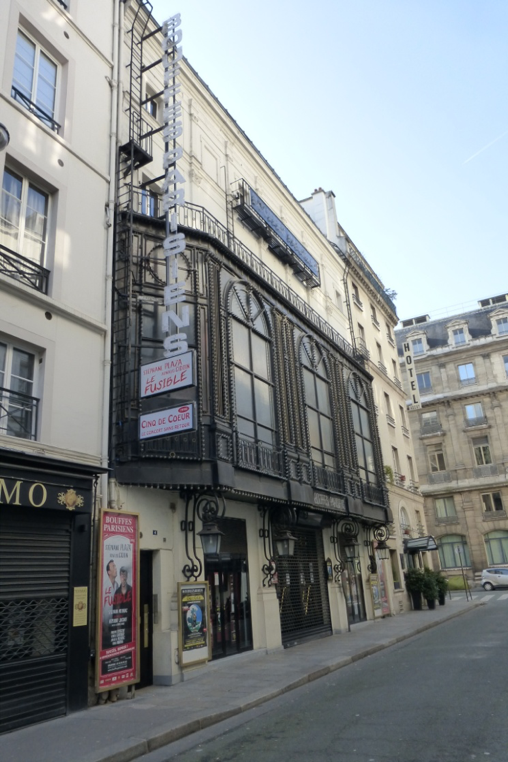
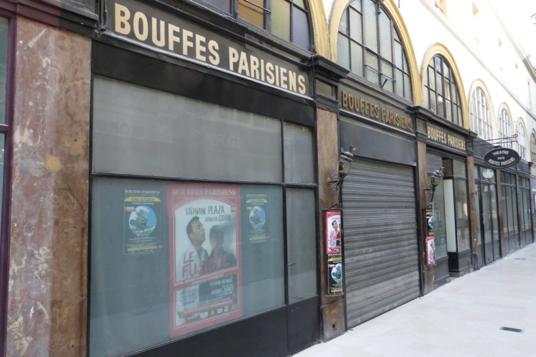

**5 juillet 1855** A la salle des Folies-Marigny, ancienne salle Lacaze, aux Champs-Élysées, ouverture des Bouffes Parisiens, dont le privilège venait d'être accordé à **Jacques Offenbach**, alors chef d'orchestre au Théâtre Français. Le répertoire de ce nouveau théâtre devait se composer d'opérettes simples, de saynètes, de pantomimes et d'arlequinades.

Mais les Bouffes Parisiens se trouvèrent trop à l'étroit dans leur petite salle des Champs-Elysées et vinrent s'installer dans le théâtre que **Monsieur Comte** (prestidigitateur, ventriloque et physicien de Louis XVIII) avait fait construire en 1826 dans le passage Choiseul, et dont la façade donnait sur la rue Monsigny. Ce théâtre, ouvert le 9 janvier 1827 sous le nom de Théâtre de Jeunes Elèves puis Salle Choiseul, avait eu pour directeurs successifs Comte et Lefèvre.

**21 octobre 1958** Première d'***Orphée aux Enfers*** : un triomphe ; même l'Empereur court rue Monsigny pour applaudir la dernière grande œuvre d'Offenbach.

**1863**  **Louis Varney**, alors directeur fait raser la salle et fait reconstruire un théâtre de 1100 places.

**1900**  **Messieurs Coudert** et **Berny** sont les directeurs de ce théâtre.

**1913** Changement radical de répertoire ; l'opérette n'est plus reine aux Bouffes Parisiens ; Les représentations théâtrales vont prendre le pas. **C'est le temps de Sacha Guitry , de Raimu, d'Yvonne Printemps.**

**De 1921 à 1958**  **A. Willemetz** prend la direction du théâtre **c'est l'époque de Maurice Chevalier, Jean Gabin, Edwige Feuillère, Arletty, Michel Simon, Pierre Fresnay, Jean Marais, Denise Gray, Edith Piaf, Paul Meurisse, Jeanne Moreau, Pierre Brasseur, Elvire Popesco...**

**1960Hélène Martini** s'installe aux Bouffes Parisiens pour 15 ans avec **Jacques Charron** comme directeur artistique avant de partir pour les Folies Bergères.

**Le 3 octobre 1986**  **Jean-Claude Brialy** reprend la direction du théâtre.

**2007**  **Bruno Finck** et **Dominique Dumond** prennent la direction du théâtre.

