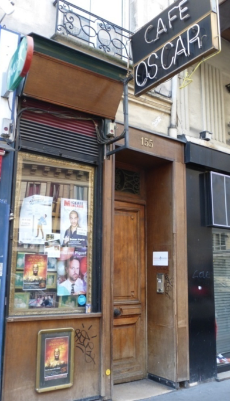

**Créé par Monika en 1993**, c'est un **café théâtre** original, animé, intimiste, convivial et confortable. Dans un décor baroque et chaleureux, où le velours rouges, les cadres dorés et les lustres anciens font bonne figure, il propose à des jeunes talents de venir se produire en public. 

Le **Café Oscar Paris** est un charmant café théâtre situé près de la Bourse au caractère intimiste du XIXème siècle saura accueillir chaleureusement vos invités pour des manifestations privés ou professionnelles Lieu de caractère, Le **Café Oscar Paris** saura accueillir à toute heure de la journée et du soir cocktails, anniversaires, conférences, après tournage, séminaires, vernissage, défilés de mode et autres manifestations. **Monika**, notre directrice artistique se fera un plaisir de vous présenter sur la scène du Café Oscar un panel d'artistes tout aussi étonnants les uns que les autres. Ici, Garou, Nathasha Saint Pierre et d'autres nous ont fait l'honneur de se produire. Enfin, votre événement pourra se clôturer en une soirée dansante ou l'équipe du Café Oscar fera danser vos invités jusqu'au bout de la nuit.

Les plus grands sont passés par là : Fabrice Eboué, D'Jal, Jarry Atypique, Kev Adams, Cyril Hanouna, Jean-Luc Lemoine, Kyan Khojandi, Mathieu Madénian, Tomer Sisley, Moustafa El Atrassi, Jérôme Daran, Alexis Macquart, Bérangère Krief, Claudia Tagbo, et bien d'autres... Ils ont tous commencé ici !\
Le Café Oscar a aussi accueilli des chanteurs tels que Garou, Yannick Noah, Natasha St Pier…