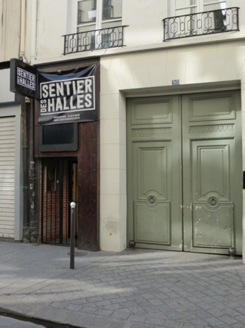

Le **Sentier des Halles** se trouve sur la **rue d'Aboukir** . Elle a été nommée, comme les voies adjacentes à la [place du Caire](https://fr.wikipedia.org/wiki/Place_du_Caire "Place du Caire"), d'après une victoire remportée en [Égypte](https://fr.wikipedia.org/wiki/%C3%89gypte "Égypte") par l'armée française en 1799.

Créé en **1982** à l'initiative de **Nicole Mingasson** à partir de plusieurs caves inoccupées puis racheté par l'Olympia, **le Sentier des Halles** est devenu une référence incontournable dans le paysage musical parisien. L'aspect convivial et intimiste de cette petite salle voûtée a séduit de très nombreux talents tels que Maurane, Maxime Le Forestier, Mano Solo, Arthur H, Rose, FFF, Albert Dupontel, ainsi que les Purefans Sessions pour le tournage de concerts en version acoustiques (Superbus, Jenifer, Tal, La Fouine, BB Brunes...).

**En 2014**, les sociétés LITTLE BROS. PRODUCTIONS, TAKTIC MUSIC et TCHOLÉLÉ s'associent pour racheter la salle et mettre en place une nouvelle programmation où l'humour et la musique sont à l'honneur avec des artistes tels que **PIERRE-EMMANUEL BARRE, DONEL JACKS'MAN, THOMAS VDB, les BLOND & BLOND & BLOND, SHIRLEY SOUAGNON, PIERRE CROCE ou JULIE VICTOR. KHEIRON** y a également posé ses valises pour animer plusieurs fois par semaine un plateau où défilent les figures montantes et incontournables du stand-up parisien.

A la réouverture en **Septembre 2014** après plusieurs semaines de travaux, les spectateurs ont découvert un espace accueil et bar complètement ré-agencé, les artistes des nouvelles loges et les techniciens un matériel son et lumière renouvelé et de haute qualité permettant de travailler dans des conditions techniques optimales.