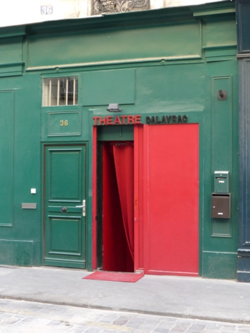

Le **théâtre Delayrac** est situé sur cette rue ouverte en 1826 en même temps que la [rue Marsollier](https://fr.wikipedia.org/wiki/Rue_Marsollier "Rue Marsollier") comme rue de pourtour de l'[Opéra-Comique](https://fr.wikipedia.org/wiki/Op%C3%A9ra-Comique "Opéra-Comique") ([salle Ventadour](https://fr.wikipedia.org/wiki/Salle_Ventadour "Salle Ventadour")) qui fut construit cette année-là sur l'ancien emplacement de l'ex-Hôtel de Lionne. Elle reçut en 1829 le nom du compositeur [**Nicolas Dalayrac**](https://fr.wikipedia.org/wiki/Nicolas_Dalayrac "Nicolas Dalayrac").

Le **théâtre Delayrac** est remplacé aujourd'hui par le **SOUM SOUM.**

