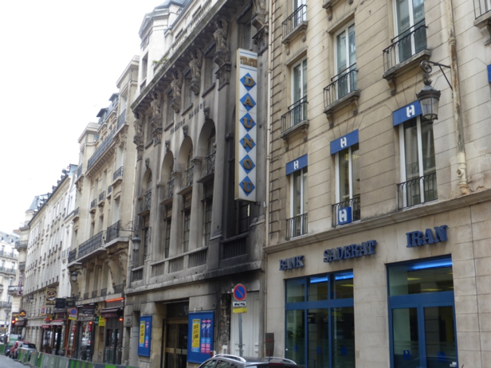

Commandé par la comédienne [**Jane Renouardt**](https://fr.wikipedia.org/wiki/Jane_Renouardt "Jane Renouardt") à l'architecte [**Auguste Bluysen**](https://fr.wikipedia.org/wiki/Auguste_Bluysen "Auguste Bluysen"), le théâtre fut bâti en [**1921**](https://fr.wikipedia.org/wiki/1921 "1921") dans un style [Art déco](https://fr.wikipedia.org/wiki/Art_d%C3%A9co "Art déco"), la décoration intérieure, réalisée par [**Armand Rateau**](https://fr.wikipedia.org/w/index.php?title=Armand_Rateau&action=edit&redlink=1 "Armand Rateau (page inexistante)").

Il est inauguré le [**30**](https://fr.wikipedia.org/wiki/30_d%C3%A9cembre "30 décembre") [**décembre**](https://fr.wikipedia.org/wiki/D%C3%A9cembre_1921 "Décembre 1921") [**1921**](https://fr.wikipedia.org/wiki/1921 "1921") avec *Une sacrée petite blonde* d'[André Birabeau](https://fr.wikipedia.org/wiki/Andr%C3%A9_Birabeau "André Birabeau") et [Pierre Wolff](https://fr.wikipedia.org/wiki/Pierre_Wolff "Pierre Wolff"), suivi de l'opérette *Ta bouche* d'[Yves Mirande](https://fr.wikipedia.org/wiki/Yves_Mirande "Yves Mirande") et [Albert Willemetz](https://fr.wikipedia.org/wiki/Albert_Willemetz "Albert Willemetz"), musique de [Maurice Yvain](https://fr.wikipedia.org/wiki/Maurice_Yvain "Maurice Yvain").

**En [1926](https://fr.wikipedia.org/wiki/1926 "1926")**, la comédienne [**Madeleine Carlier**](https://fr.wikipedia.org/w/index.php?title=Madeleine_Carlier&action=edit&redlink=1 "Madeleine Carlier (page inexistante)") loue le théâtre. **En [1939](https://fr.wikipedia.org/wiki/1939 "1939")**, [**René Sancelme**](https://fr.wikipedia.org/w/index.php?title=Ren%C3%A9_Sancelme&action=edit&redlink=1 "René Sancelme (page inexistante)") devient le propriétaire du théâtre qui est loué à [**François d'Orgeix**](https://fr.wikipedia.org/wiki/Jean_d%27Orgeix "Jean d'Orgeix"). En 1946, [**René Sancelme**](https://fr.wikipedia.org/w/index.php?title=Ren%C3%A9_Sancelme&action=edit&redlink=1 "René Sancelme (page inexistante)") confie la direction à son épouse.

**Le 30 décembre 1931** :La salle ouvre ses portes. Sous la direction éclairée et avisée de la célèbre comédienne **Jane Renouardt,** opérettes, comédies, revues se succédent sur la scène du Théâtre et constituent autant de succès indiscutés

**En 1939 Monsieur René Sancelme** se rend acquéreur du Théâtre Daunou. En 1946, il confie la direction à Mme René Sancelme. On peut dire aujourd'hui, que sous son impulsion, le Théâtre Daunou est redevenu l'une des scènes des plus en vue de nos théâtres de boulevard.

**Décembre 1971** Dans la nuit du 9 au 10 décembre, un incendie détruit le théâtre.

**1973** A la suite de cet incendie, Monsieur René Sancelme décide de rouvrir le Théâtre, qu'il fait entièrement rénover. Le 1er février, le rideau s'ouvre à nouveau.

**1990 Au décès de Mme Sancelme, Mlle Denise Petitdidier** devient la nouvelle directrice du théâtre Daunou.
