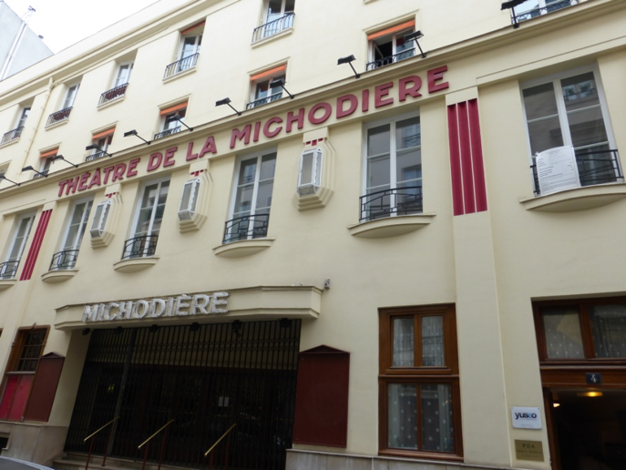

**En 1925**, construit selon les plans de l'architecte **Bluysen** et décoré par **Ruhlmann**, sous la direction de **Gustave Quinson**, le **théâtre de la Michodière** est inauguré sous le signe du Scorpion, le **16 novembre 1925**, avec *L'Infidèle éperdue*, de Jacques Natanson.

**En 1927**, **Victor Boucher** prend la direction du théâtre, et trouve en **Edouard Bourdet** l'auteur maison qui donnera ses lettres de noblesse à la **Michodière** !

*La Prisonnière*, *Vient de paraître*, *Le Sexe faible*, *La Fleur des pois*, *Les Temps difficiles*, et *Fric Frac* confirment le talent d'**Edouard Bourdet**. Ses œuvres demeurent des classiques du théâtre de boulevard, et elles seront reprises de nombreuses fois un peu partout dans le monde !\
**En 1937**, la grande **Yvonne Printemps** apporte son nom, son charisme et ses compétences au service de la **Michodière.**

Elle s'impose, et même **Pierre Fresnay**, le monstre sacré de l'après guerre, subira dans sa vie artistique et privée, la personnalité de cette femme battante et moderne. Leur union sera décisive dans le choix des pièces jouées à la **Michodière**, Le cap des années quarante a fait évolué les goûts ; **Fresnay et Printemps** dirigent tous les deux ce beau théâtre et lancent de nouveaux auteurs : Anouilh, Roussin pour ne citer que les plus célèbres... Avec **Anouilh**, la **Michodière** change de ton. Les dialogues sont corrosifs, provocants et empreints d'un humour grinçant. Les comédies de mœurs caricaturent sans ménagement la bourgeoisie française et bousculent les interdits sous une apparente légèreté. Ce nouveau langage fascine !

On aime, mais **Anouilh** est trop « intello » pour l'esprit Boulevard, et il s'envole bientôt vers d'autres horizons. **Roussin** prend la relève en apportant lui aussi son modernisme, mais dans un style plus souriant ou le trio classique : femme, mari, amant, tient l'affiche. Il traite ce sujet avec cruauté, mais le ton reste léger. L'émotion et le rire se mêlent dans une morale toujours sauve. De la vraie comédie !

Le public ne s'y trompe pas : *Les Œufs de l'autruche*, puis *Bobosse* le consacre par un record de représentations ! La **Michodière** devient une référence de qualité et de bon goût ! Les plus grands auteurs vont s'y succéder.

L'influence avant-gardiste de **François Périer**, chargé de la direction artistique par **Yvonne Printemps**, prend le relais. On découvre Marcel Achard : *Auprès de ma blonde*, Félicien Marceau : *La Preuve par quatre*, Jean de Hartog : *Le Ciel de lit*, et on chuchote déjà les noms de Françoise Dorin : *Comme au théâtre*, Jean-Loup Dabadie...

**En 1975**, **Pierre Fresnay** disparaît. Le monde du théâtre est en deuil. Sans lui, la **Michodière** n'est plus ce qu'elle était, et lorsque deux ans plus tard, Yvonne Printemps se retire, c'est le désarroi total. La **Michodière** est laissé à l'abandon. Décors et accessoires perdent leur lustre. La poussière s'installe dans le silence. Le lourd rideau moisit lentement sur la scène vide. Dans les loges, les photos jaunissent dans l'indifférence. Qui viendra sauver la **Michodière** ?

**Jacques Crépineau** paraît être l'homme de la situation. Secrétaire général, animateur et directeur artistique dans de nombreux théâtres, son expérience est indiscutable. Il trouve l'appui et les aides nécessaires auprès des grandes instances artistiques et administratives.

**En 1981**, il retrouve la **Michodière** et le bureau directorial d**'Yvonne Printemps** avec émotions.

Que de chemin parcouru depuis le jour ou, après avoir assisté à une représentation des *Œufs de l'autruche*, il frappa à la loge de la comédienne pour lui parler de son amour du théâtre. Il se rappelle le désappointement d'Yvonne Printemps, quand, à sa question : « Vous voulez être comédien, bien sur ? », Il répondit non !\
Elle hésita avant de lui dédicacer une photo.\
« Quoi dire à ce jeune homme ? »\
Elle griffonna sans y croire : « Avec mes vœux », ne sachant pas trop bien ce qu'il voulait... !
Il ne l'a jamais revue depuis ce jour, mais possède encore la photo dont la dédicace prend aujourd'hui, un sens prémonitoire.

La **Michodière** se réveille. On habille de neuf le beau théâtre endormi et le spectateur reprend ses droits !
Avec Poiret et Dabadie, le théâtre de boulevard cherche de nouveaux maîtres.
Leurs essais sont prometteurs et favorablement accueillis par le public et la critique, et les rires font de nouveau vibrer les cintres de la **Michodière** ! Puis le café-théâtre fait son apparition. La **Michodière** tente l'expérience : c'est un succès, mais il est bref, car le public se lasse du langage de « tous les jours », sans finesse et sans recherche. Le café-théâtre s'essouffle et la **Michodière** cherche ses marques.

**De 1981 à 2014, Jacques Crépineau** a présidé, avec brio et talent, à la destinée du Théâtre de la **Michodière.**

La saison **2014/2015** marquait, en ce lieu, le début d'une nouvelle vie. En **avril 2014**, le Théâtre de la **Michodière** fut racheté par la société vente-privée.com fondée par **Jacques-Antoine Granjon**, associé à l'homme d'affaire et producteur **Richard Caillat** et à **Stéphane Hillel**, acteur, metteur en scène et directeur du Théâtre de Paris, Théâtre de Paris ayant été repris deux ans plus tôt par les trois mêmes associés.

Grâce à cette nouvelle énergie, le **Théâtre de la Michodière** veut offrir toujours plus de divertissement et de bonheur aux spectateurs avec une programmation ambitieuse et prestigieuse.
