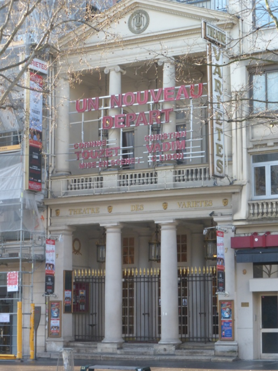

Le **théâtre des Variétés** doit sa création à **Marguerite Brunet, dite [Mlle Montansier](https://fr.wikipedia.org/wiki/Mademoiselle_Montansier "Mademoiselle Montansier")**. Déjà propriétaire d'un [théâtre à Versailles](https://fr.wikipedia.org/wiki/Th%C3%A9%C3%A2tre_Montansier "Théâtre Montansier") inauguré **en 1777**, elle profite de la [Révolution](https://fr.wikipedia.org/wiki/R%C3%A9volution_fran%C3%A7aise "Révolution française") pour s'installer à Paris **en 1790** et prendre possession du [théâtre des Beaujolais](https://fr.wikipedia.org/wiki/Th%C3%A9%C3%A2tre_des_Beaujolais "Théâtre des Beaujolais"), sous les arcades du [Palais-Royal](https://fr.wikipedia.org/wiki/Palais-Royal "Palais-Royal"), qu'elle rebaptise « Variété-Montansier » puis tout simplement « Variétés ». Mal vue par le [nouveau régime](https://fr.wikipedia.org/wiki/Consulat_(histoire_de_France) "Consulat (histoire de France)"), elle est mise en prison pour dettes **en 1803**, avant qu'un décret n'ordonne l'évacuation de sa troupe dont le succès porte ombrage au [Théâtre-Français](https://fr.wikipedia.org/wiki/Com%C3%A9die-Fran%C3%A7aise "Comédie-Française") voisin, **le [1er](https://fr.wikipedia.org/wiki/1er_janvier "1er janvier") [janvier](https://fr.wikipedia.org/wiki/Janvier_1807 "Janvier 1807") [1807](https://fr.wikipedia.org/wiki/1807_au_th%C3%A9%C3%A2tre "1807 au théâtre")**.

Reçue par l'[Empereur](https://fr.wikipedia.org/wiki/Napol%C3%A9on_Ier "Napoléon Ier"), **Mlle Montansier** obtient, à 77 ans, son aide et sa protection. À la tête de la société des Cinq, elle fait édifier une nouvelle salle sur les boulevards près du [passage des Panoramas](https://fr.wikipedia.org/wiki/Passage_des_Panoramas "Passage des Panoramas"). Conçu par les architectes [**Jacques Cellerier**](https://fr.wikipedia.org/wiki/Jacques_Cellerier "Jacques Cellerier") et [**Jean-Antoine Alavoine**](https://fr.wikipedia.org/wiki/Jean-Antoine_Alavoine "Jean-Antoine Alavoine"), le théâtre est inauguré le **[24](https://fr.wikipedia.org/wiki/24_juin "24 juin") [juin](https://fr.wikipedia.org/wiki/Juin_1807 "Juin 1807") [1807](https://fr.wikipedia.org/wiki/1807_au_th%C3%A9%C3%A2tre "1807 au théâtre")** avec *Le Panorama de Momus*, [vaudeville](https://fr.wikipedia.org/wiki/Vaudeville "Vaudeville") de [Marc-Antoine-Madeleine Désaugiers](https://fr.wikipedia.org/wiki/Marc-Antoine-Madeleine_D%C3%A9saugiers "Marc-Antoine-Madeleine Désaugiers").

**De 1820 à 1855** Les directeurs et les vaudevilles se succèdent à un rythme tel que l'expression "on répète aux Variétés" passe pour devenir un proverbe exprimant un effort inutile.\
**27 mai 1855** le théâtre est rajeuni de la scène au poulailler et Hippolyte Cogniard inaugure avec humour et éclat un règne qui devait marquer les Variétes d'un halo de gloire. Sa revue brillante Ohé ! Les P'tits Agneaux ! remporte tous les succès et l'actrice Hortense Scneider devient l'actrice reine du théâtre.\
**13 décembre 1864**  **Hippolyte Cognard** opère un revirement de style majeur en faisant jouer ***La Belle Hélène***, opérette de **Jacques Offenbach** qui remporte un immense succès. C'est le début d'une belle collaboration entre Offenbach et « les Variétés ».

**En 1870** La guerre interrompt la représentation de la dernière opérette d'Offenbach, ***Les Brigands***. Les salles parisiennes ferment les unes après les autres.

**En 1871** M.Adolphe Thiers, Président de la République, l'Alsace et la Lorraine cédées à l'Allemagne, les fastes de l'Empire ne sont plus qu'un souvenir. Comme pour renouer avec le passé, **Eugène Bertrand**, nostalgique, ouvre les Variétés avec une opérette nouvelle d'Offenbach ***Boule de neige***.

**En 1880** Jacques Offenbach meurt à l'âge de soixante et un ans. Un autre personnage-clé du Théâtre des Variétés qui lui avait donné vingt-trois comédies meurt sept ans plus tard : Eugène Labiche.\
**1er janvier 1892** **M.-F. Samuel** prend la direction de la salle du boulevard Montmartre. Remarquable créateur de spectacles, avec lui commence la manière moderne de diriger un théâtre. Amateur d'opérette et de comédies, sous sa férule, les Variétés devinrent à la fois le conservatoire et la pépinière de l'une et de l'autre.

**En 1914** La guerre clôt cette période faste. Samuel meurt et **Max Maurey** prend la direction des Variétés mais doit attendre la fin de la guerre pour les faire revivre.

**de 1919 à 1936**  Max Maurey, auteur dramatique et homme de théâtre accompli, ne donne pas moins de soixante-six spectacles sur la scène des Variétés que l'on dit être alors "le plus parisien des théâtres de Paris".

**En 1933** C'est l'année **Sacha Guitry** aux Variétés. Il donne successivement : ***Châteaux en Espagne*** qu'il interprète avec **Jacqueline Delubac** et **Pauline Carton**, ***L'Illusionniste*** et ***Florestan 1er, Prince de Monaco***, une opérette dont la musique est de Heymann.

**En 1937** Max Maurey fait appel à **Vincent Scotto**, **Alibert et Marcel Pagnol** pour « monter » Marseille à Paris et offrir au public de la capitale dix années d'accent", de galéjades et de chants de cigales.

**En 1946** En 1946 avec la direction de **MM. Denis et Marcel Maurey**, le Théâtre des Variétés connaît en trente ans une centaine de spectacles, des succès prodigieux et de mémorables soirées. Avec ***La Grosse Valse*** de Robert Dhéry mettant en scène **Louis de Funès**, les frères Maurey ont un de leur plus grand succès.

**En 1975 Jean-Michel Rouzière**, directeur du théâtre du Palais-Royal, prend la direction des Variétés. Après plusieurs mois de rénovation, le théâtre redevient tel qu'à la première de La Belle Hélène.

Après la disparition brutale de **Jean-Michel Rouzière** le **14 février 1989** un nouveau Président Directeur Général succédait à la tête des deux théâtres du Palais-Royal et des Variétés, **M. Francis Lemonnier en décembre 1989**, tandis que la Présidente, avec de nouveaux protagonistes, poursuivait sa brillante carrière.

**En 1991 Jean-Paul Belmondo** propriétaire du théâtre en devient le directeur.

**Depuis 2005 Jean Manuel Bajen** rachète le Théâtre des Variétés à Jean-Paul Belmondo et devient alors le directeur.