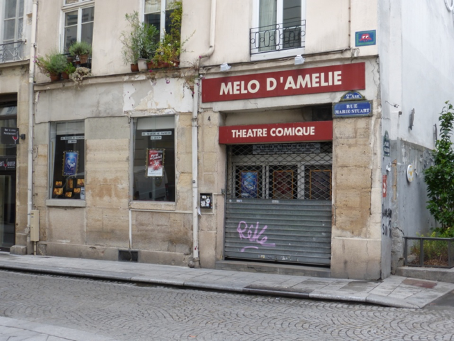

**Le Mélo d'Amélie** existe à Paris depuis **décembre 1994** en lieu et place de l'ancien théâtre Marie Stuart qui avait fermé ses portes définitivement six mois plus tôt.

C'est donc sur l'initiative de **Christian Dob, Xavier Letourneur, Muriel Lemaire, Rémi Rosello et Michel Rougeron** que Le Mélo d'Amélie qui avait fait les beaux jours de **Montpellier de 1980 à 1993**, s'installe à Paris.

Le lieu ouvre donc à Paris, avec d'abord des pièces de **Christian Dob**, notamment «Passage avide».

**En 1996 Christian Dob**, qui retourne à Montpellier pour y créer le «Grand Mélo» (ouverture en 1998), vend ses parts à Michel Rougeron (Directeur), Xavier Letourneur (Directeur artistique) et Muriel Lemaire.

**Début 2008**, l'équipe du Mélo se renforce avec l'arrivée de **Jean-luc Lopez et Olivier Payre**. Xavier Letourneur restant à la programmation.

Par ailleurs et **dès 1997** un des buts majeurs que s'était assignés la direction du Mélo voit enfin le jour :\
Un spectacle créé sur Paris, au Mélo d'Amélie, allait dans **une salle plus grande !**

Le Mélo d'Amélie devenait un lieu tremplin, permettant à des acteurs, auteurs, metteurs en scène, non qualifiés «tête d'affiche», de présenter leur spectacle dans d'excellentes conditions, avec la ferme intention de finir dans une grande salle parisienne :

La qualité des comédiens et auteurs qui travaillent pour le Mélo, a permis en 1999 de créer « Un monde merveilleux » directement à la Comédie de Paris, puis au Splendid.

Depuis, le Mélo d'Amélie a participé activement à la création de « Des Acteurs sont Fatigués » , « Entorse pour une enflure » , « Tout un cinéma » et « On choisit pas ses vacances » à la Comédie Caumartin, des « Mille Pattes » au Daunou , de « De Toutes Manières » à la Comédie de Paris et à la Comédie Caumartin, et de « Crises de mères » au Splendid.