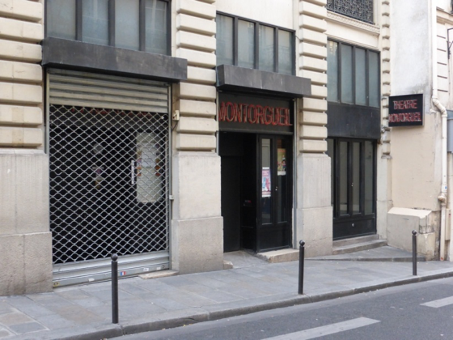

Le théâtre **Montorgueuil** se trouve au N°3 de la rue du sentier qui résulte de la réunion des rues *Gros-Chenet* et du *Sentier*, anciennement appelée *Chantier*, *Centier* ou *Centière*. Elle comprend plusieurs hôtels particuliers.

**Depuis les [années 1990](fr.wikipedia.org/wiki/Ann%C3%A9es_1990 "Années 1990")**, cette rue qui abrite encore des grossistes en vêtements, s'est développée dans les activités des médias, de la communication et de l'internet. Son nom a fait la une des journaux dans ces mêmes [années 1990](fr.wikipedia.org/wiki/Ann%C3%A9es_1990 "Années 1990") à la suite des [affaires d'escroquerie et de blanchiment d'argent](fr.wikipedia.org/wiki/Affaire_du_Sentier_II "Affaire du Sentier II") découvertes dans ce quartier.
