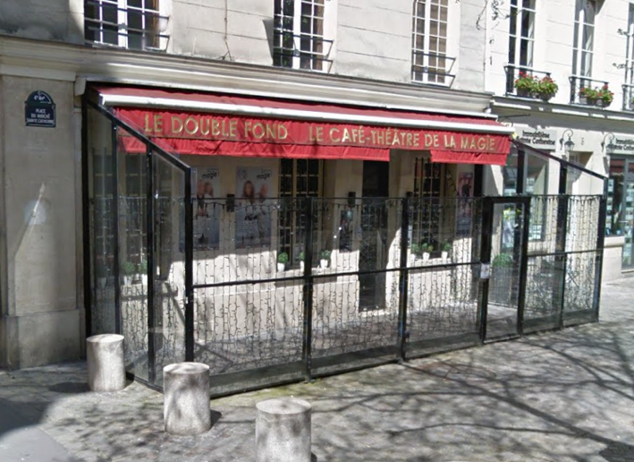

**En 1988 Dominique Duvivier** achète une ancienne boîte de nuit antillaise qui s’appelait « Le Colombo » pour créer le premier théâtre entièrement consacré à la magie en Europe : un pari osé auquel personne ne croyait… à part lui !
Avec **Gaëtan Bloom**, il choisit de baptiser l’endroit **« Le Double Fond »**. L’ouverture a lieu **le 1er juin.**
**En 1989** les spectacles sont assurés par **Dominique Duvivier et Gaëtan Bloom**. Eugene Burger (USA) donne la 1ère conférence du Double Fond.

**En 1990** les spectacles sont joués par **Dominique Duvivier** en duo avec **Agnès Samsoën** puis, **en 1991 et 1992**, en duo avec **Quoc Tien Tran**. **Alexandra Duvivier**, qui a alors 19 ans, fait ses premières apparitions sur la scène du Double Fond.

**En 1992** un département spécialisé dans les prestations magiques événementielles est créé : les magiciens de la troupe du Double Fond sont amenés à réaliser des prestations partout en France et en Europe.

**De 1993 à 1998, Dominique Duvivier** se consacre davantage à la création. Il laisse la troupe du Double Fond faire ses armes sur scène : on découvre la douce folie du mentaliste Philippe de Perthuis, l’inventivité de La Bride, l’humour de Pépé le Moko et la technicité de Jean-Pierre Crispon, dans un spectacle intitulé « Show en or ».

**En 1993, Le Double Fond** accueille en conférence : Richard Kaufman (USA), Kevin James (USA), Juan Mayoral (Espagne) et Mark Phillips (USA). Et en 1994 : Jean-Pierre Vallarino, Gary Kurtz (Canada), Vito Lupo (USA), John Bannon (USA) et Pascal de Clermont.

**En 1995, Le Double Fond** organise et produit, avec la boutique Mayette Magie Moderne, le congrès le « Mayette Days » au Cirque d’Hiver à Paris. En conférence on profite de la magie et de spectacle divers.
De très nombreux conférenciers viennent partager leurs secrets au Double Fond, dont la réputation dans le domaine ne cesse de croître. 

**De 1996 à 1998**, de nombreux spectacles sont présentés au **Double Fond.**

Pour ses 10 ans, **en 1998, Le Double Fond** renouvelle ses formules. **Dominique Duvivier** revient régulièrement se produire en spectacle, accompagné cette fois de sa fille : leurs premiers numéros en duo sont créés dans un spectacle appelé « Duvivier et Duvivier ».  C’est également l’année où le concept du « Coup de pouce » est lancé : régulièrement dans l’année la scène est ouverte aux amateurs et aux professionnels qui souhaitent se produire devant un vrai public. Apparition aussi du nouveau concept du « Karaoké magique » où les clients eux-mêmes peuvent devenir magiciens l’espace d’un soir.

**En 1999**, trois nouveaux spectacles sont produits : « Fous de magie » et « Magie et frissons » avec La Bride, Pépé le Moko, La Volaille et Le Nain et le spectacle pour enfants « Donner de la magie » avec Le Nain. 

**En 2000**, c’est l’arrivée du 1er spectacle complet en duo d’Alexandra et Dominique Duvivier « Magie de père en fille ».
De très nombreux conférenciers défilent au cour des années 1999 et 2000. 
 
**Le début des années 2000** est particulièrement dynamique et marque la fin des années difficiles. Le succès du public est croissant : **de 1998 à 2008**, le nombre de spectateurs a doublé, notamment grâce à la mise en place de formules clés en main pour les enfants (spectacle, atelier, goûter d’anniversaire) et pour toutes les grandes occasions (anniversaire, enterrement de vie de célibataire, Noël, Jour de l’An, St Valentin, Halloween…).

Porté par une belle couverture médiatique et une nouvelle politique commerciale (mise en place d’un système de restauration sur place et développement d’offres à destination des entreprises), le **Double Fond** multiplie les créations de spectacle : **en 2001**, c’est « Le Roi Arthur » avec Alexandra et Dominique Duvivier, « Seule » avec Alexandra Duvivier, « Tours et détours » avec **Quoc Tien Tran** et « Intimiste » avec **Dominique Duvivier en 2002** « Bizarreries mentales » et « Mille visages » avec Philippe de Perthuis. 

**En 2003**, pas moins de sept spectacles seront créés. **A partir de 2003**, pour ses 15 ans, Le Double Fond accueille chaque année des invités prestigieux qui rejoignent la troupe pour quelques soirées exceptionnelles. 

**En 2013**, pas moins de six conférenciers ont été programmés. **En 2014**, création de quatre spectacles. **En 2015**, deux spectacles ont été créés. **En 2016**, création de quatre spectacles. **En 2017** création de deux spectacles et **pour 2018** l'année des 30 ans du **Double Fond** pas moins de quatre spectacles seront créés.

