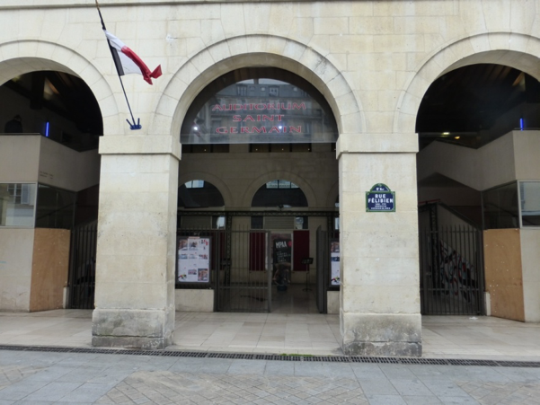

**La MPAA**, établissement culturel de la Ville de Paris, a pour mission de soutenir, développer et favoriser les pratiques artistiques en amateur de tous les parisiens.

Avec son plateau de 140m² et ses 320 fauteuils, la MPAA/Saint-Germain est une salle de grande qualité, aussi confortable pour le public que pour les artistes et qui peut accueillir toutes formes de spectacles vivants.
**La MPAA/Saint-Germain** héberge également un pôle ressources constitué de nombreux ouvrages et documents sur les pratiques amateurs, consultables sur place.
 
**La MPAA** collecte et met à disposition des amateurs toutes les informations utiles à leurs pratiques : recensement des structures d’enseignement, des salles de répétitions et de diffusion à Paris, recensement des ensembles amateurs (compagnies de théâtre, de danse, chorales, orchestres…). La MPAA propose également des ouvrages et des études sur l’univers des pratiques amateurs. Les services du pôle ressources sont entièrement gratuits et consultables en ligne ou sur place à la **MPAA/Saint-Germain**,

Théâtre, danse, musique, lectures, performances… La scène de la **MPAA/Saint-Germain** accueille chaque saison plus de 160 représentations et propose une programmation riche et variée, mêlant créations amateurs et artistes professionnels. 
Marque de fabrique de la **MPAA** : tous les artistes professionnels programmés proposent des ateliers en lien avec leur travail de création.

Danse, opéra, musique assistée par ordinateur, théâtre, bande dessinée… Chaque saison, la MPAA organise plusieurs dizaines d’ateliers dans les différentes disciplines artistiques. Initiations ou master-classes de quelques heures, ateliers « grand format » sur plusieurs mois au cours desquels les amateurs participent à la création d’un spectacle.

