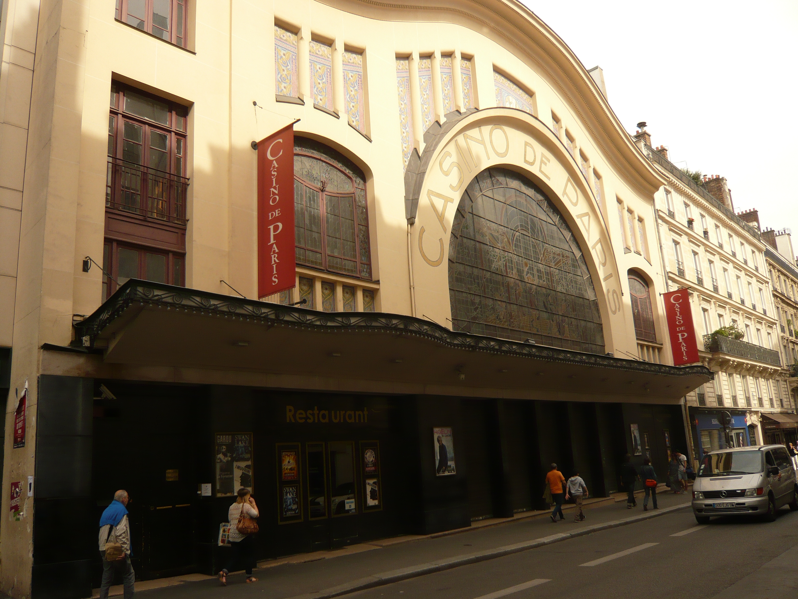

**1880** Les deux salles du flambant neuf **Palace-théâtre** sont inaugurées : l'une située côté rue Blanche et appelée **Nouveau-Théâtre**, l'autre, rue de Clichy, dite **Casino de Paris**. Cette dernière connaît un succès immédiat. Un succès porté par les débuts de Mistinguette sur scène, mais aussi par le premier numéro de nu de l'histoire du music-hall!

**Année 1920** Les 24 revues créées sous la direction de **Léon Volterra** valent à cet établissement le titre de meilleur music-hall de la capitale. L’époque de l'entre-deux-guerres voit les plus grands défiler sur son escalier de lumière, de Joséphine Baker à Cécile Sorel en passant par Maurice Chevalier et Tino Rossi.

**Années 1950** Le succès perdure après la Libération, les revues du Casino de Paris obtiennent alors un succès tel qu'elles restent bien souvent plus de deux ans à l'affiche. Et lorsque Line Renaud y fait ses débuts **en 1959**, ce sont plus de cent personnes qui l'accompagnent sur scène. Mais l'âge d'or ne dure pas...

**Année 1970** Les recettes de la salle baissent irrémédiablement. **En 1978**, c'est même la grève : le personnel proteste contre le licenciement de deux danseurs. En vain : les revues sont désormais trop chères.

**En 1980 Le Casino** ferme ses portes. Et s'il les rouvre **en 1982**, c'est sous un jour nouveau. **Le Casino** commence alors une nouvelle carrière et va démontrer qu’il reste un lieu privilégié pour le spectacle.
Avec les adieux triomphants de Tino Rossi **en 1982**, sur la scène où il fit ses débuts, le Casino de Paris rompt définitivement avec la tradition des Grandes Revues.
Le Casino commence alors une nouvelle carrière et va démontrer qu’il reste un lieu privilégié pour le spectacle.
