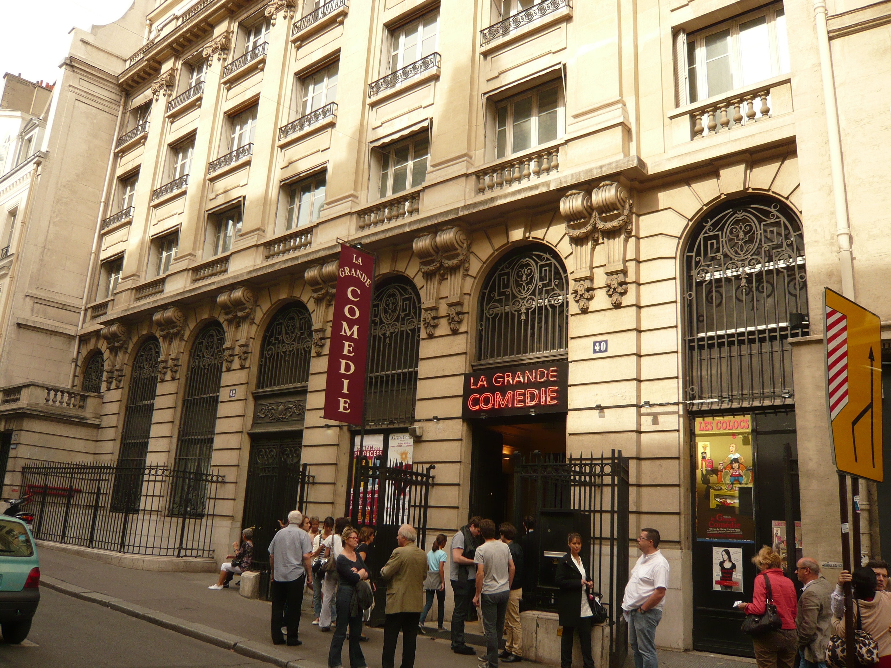

**La Grande Comédie** est salle de théâtre parisienne créée **en 2005**, située 40 rue de Clichy dans le 9ème arrondissement de Paris.
 
Gérée par **Hazis Vardar**, également propriétaire d'autres salles en France, elle propose une programmation exclusivement consacrée aux comédies de boulevard et aux one-man shows.
 
Le théâtre est composé de deux salles : la grande salle (la salle 1), d'une capacité de 400 places, a accueilli par le passé entre autres OMAR et FRED , Max BOUBIL, Les Lascars Gays, Boire Fumer et Conduire Vite de Philippe LELLOUCHE, Le Président, sa femme et moi de Bernard UZAN, Le clan des divorcées d'Alil VARDAR...
 
Ce théâtre, ouvert toute l'année, est devenu au fil du temps un véritable temple de l'humour parisien, de par sa programmation comique accessible et grâce la notoriété des artistes qui s'y produisent.
