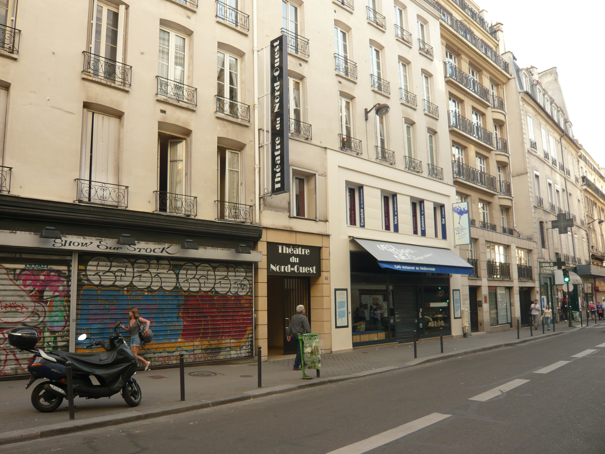

**Année 1930** La salle du **Théâtre** abrite un cabaret réputé, qui prend à la Libération le nom de **“Club des Cinq”** en référence aux cinq anciens de la 2e Division Blindée, parmi lesquels Lucien Roup, l’entraîneur de Marcel Cerdan.
Edith Piaf elle-même y chante à plusieurs reprises et investit ce lieu qui lui devient cher – les coulisses du théâtre actuel abritent d’ailleurs toujours la loge de Madame Edith, non loin de la Salle Laborey. Elle y invite en première partie un chanteur plein de promesses qui fait ainsi ses débuts à Paris :  
Yves Montand, Gabin, Carné ou Prévert fréquentent alors le lieu avec assiduité.

**1954-1991** Le paysage changeant des réalités parisiennes a cependant raison de la belle ascension du **“Club des Cinq”**. Les locaux sont rapidement convertis en cinéma : Le Club assure la projection de films variés, allant de la distraction familiale aux œuvres engagées, toujours sous l’égide des grands noms de l’époque. On peut voir aujourd’hui de nombreux vestiges de cette longue vocation : cabines de projection, sièges en gradin, support des objectifs…

**1991 Le Club** se fait **“Passage du Nord-Ouest”** et rassemble les amateurs de Rock qui s’y pressent en nombre. L’expérience, bien que couronnée de succès, ne fait pas le bonheur du voisinage et ne dure guère.

**25 juin 1997** La Compagnie de l’Élan, conduite par Jean-Luc Jeener, investit les locaux. Deux salles y sont créées, la Salle Économides, couramment appelée “Petite Salle” et la Salle Laborey, la “Grande Salle”, toutes deux dédiées à des compagnons de route décédés prématurément.  
