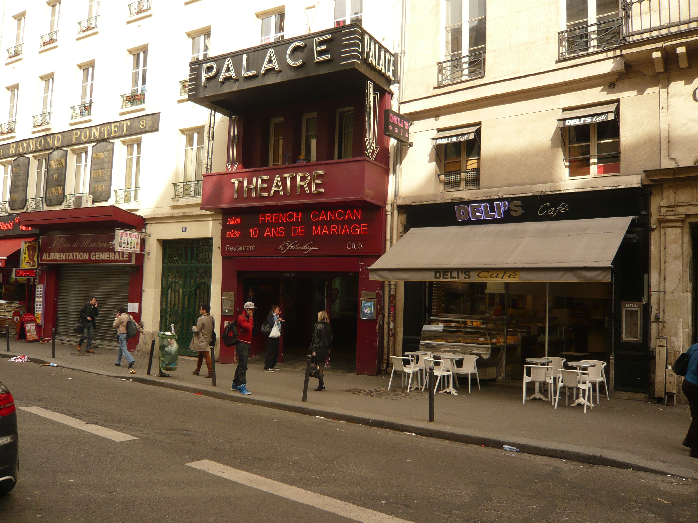

**En 1923** Ouverture comme salle de music-hall et de cinéma .

**De 1975 à 1978** Il redevient un théâtre dirigé par **Pierre Laville**.Le bâtiment du faubourg Montmartre est presque à l'abandon, mais le ministre de la Culture de Valéry Giscard d'Estaing, Michel Guy, choisit l'endroit pour y installer le tout nouveau Festival d'automne à Paris.

**Le 1er mars 1978 Fabrice Emaer** après d'importants travaux, recomposants le décor initial des années 30 ouvre cet espace avec un show de Grace Jones, mannequin international, vedette et chanteuse. Très vite **Le Palace** devient l'endroit à la mode et la discothèque la plus (et la mieux) fréquentée de la capitale. Les soirées à thèmes s'y succèdent et on y réinvente un style oublié, le bal. **Fabrice Emaer** meurt **en 1983**. C'est la fin d'une époque.

**Le Palace** est repris par d'ex-associés de **Fabrice Emaer** mais au fil des ans les dettes s'accumulent. A plusieurs reprises, des trafics de stupéfiants conduisent à la fermeture administrative du lieu pour des périodes de trois à six mois, fragilisant d'autant la situation financière.

**En 1992 Régine** elle-même, ancienne "rivale" dans la nuit de **Fabrice Emaer**, « Reine de la Nuit parisienne », essaie de reprendre le site, suivie **en 1994** par le couple **David et Cathy Guetta** qui tente de le relancer par le Privilège, relooké et rebaptisé Kitkat. Les décorations de Garouste disparaissent.

Fermeture définitive **en  1996**. Dans les années qui suivent, **le Palace** désaffecté est occupé par un squatt. 

**En novembre 2006**, **Chantal et Francis Lemaire**, co-propriétaires de Radio Contact et Bel RTL en Belgique et **les frères Vardar**, des Belges d'origine albanaise déjà propriétaires de la Grande Comédie et Comédie République, ont racheté la salle.

**Février 2007** Les travaux de restauration du **Palace** commencent sous la houlette des Monuments Historiques (le théâtre est classé) et l'architecte François Préchac est désigné pour superviser les travaux. L'objectif est de restituer le décor du théâtre d'origine, tel qu'il a été construit **en 1923**, avec les aménagements techniques et la fonctionnalité d'une salle de spectacle moderne. 

Après sa réhabilitation, Le Palace a ouvert (970 places) pour y accueillir **dès 2008** le retour de Valérie Lemercier sur les planches.
