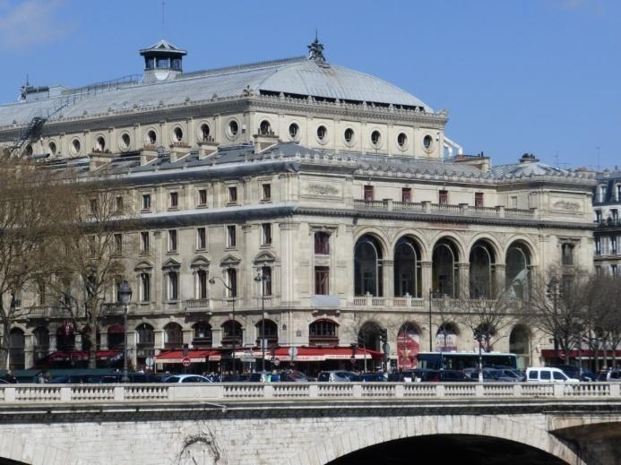
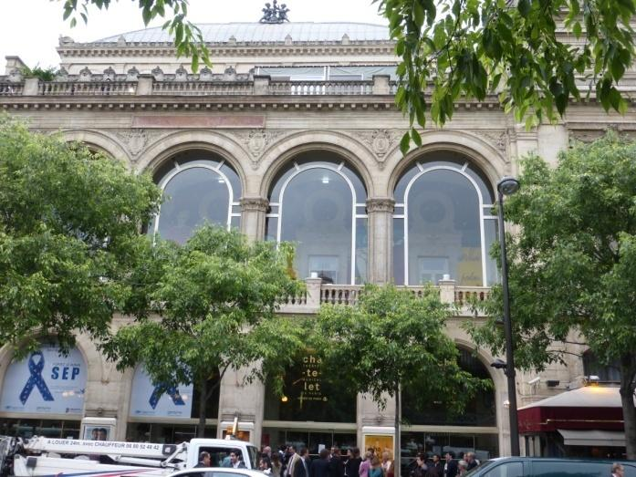

Le **théâtre impérial du Châtelet** est construit entre [1860](https://fr.wikipedia.org/wiki/1860) et [1862](https://fr.wikipedia.org/wiki/1862) par [Gabriel Davioud](https://fr.wikipedia.org/wiki/Gabriel_Davioud) à la demande du [baron Haussmann](https://fr.wikipedia.org/wiki/Georges_Eug%C3%A8ne_Haussmann), à la même époque que l'actuel [théâtre de la Ville](https://fr.wikipedia.org/wiki/Th%C3%A9%C3%A2tre_de_la_Ville) qui lui fait face de l'autre côté de la [place du Châtelet](https://fr.wikipedia.org/wiki/Place_du_Ch%C3%A2telet). L'emplacement correspond à l'ancienne forteresse du [Grand Châtelet](https://fr.wikipedia.org/wiki/Grand_Ch%C3%A2telet), qui servit de prison et de tribunal sous l'[Ancien Régime](https://fr.wikipedia.org/wiki/Ancien_R%C3%A9gime), et qui fut détruit en [1808](https://fr.wikipedia.org/wiki/1808) durant le règne de [Napoléon 1er](https://fr.wikipedia.org/wiki/Napol%C3%A9on_Bonaparte). 

**19 août 1862** le Théâtre impérial du Châtelet donne son spectacle inaugural en présence de l'impératrice Eugénie : Rothomago, féerie de MM. d'Ennery, Clairville et Monnier. Avec ses 2 500 places et une scène de 24 x 35 mètres, ce théâtre est alors la plus grande salle de Paris. Il attire les foules de la fin du XIXe siècle venues applaudir des féeries et autres drames militaires, deux genres à grand spectacle permettant au Théâtre de mettre en valeur ses moyens en effets spéciaux et pyrotechniques, ainsi que ses machineries, qui seront pendant longtemps uniques au monde. 

**A partir de 1873** le Châtelet joue un rôle primordial dans la vie musicale française avec l'installation de l'Association des Concerts Colonne, dont l'Orchestre fait découvrir les compositeurs français de son époque (Bizet, Saint-Saëns, Lalo, Massenet, Ravel...), ressuscite le génie de Berlioz, mais joue également Mendelssohn, Wagner, Liszt, Schumann, Brahms...

**L’année 1906** marque le début des légendaires saisons mises en place par l'impresario et éditeur de musique Gabriel Astruc. C'est la grande révolution artistique du début du siècle, dont le Châtelet va se trouver le pôle principal.

**De 1928 à 1966** le Théâtre du Châtelet est dirigé par **Maurice Lehmann**. Celui-ci se lance dans l'opérette à grand spectacle et signe lui-même de nombreuses mises en scène. C'est au Châtelet que le public parisien peut alors découvrir les "musicals" qui font fureur à Broadway... 

**En 1966**, Maurice Lehmann abandonne le Châtelet. Les directions se succèdent et, en 1979, la Ville de Paris décide de reprendre l'un des plus beaux théâtres de la capitale. Le Théâtre du Châtelet ferme pour travaux : la fosse d'orchestre et les planchers de la scène sont remis à neuf et modernisés ; la salle est réaménagée grâce à la suppression des loges de corbeille et à l'installation de nouveaux fauteuils. 

**En 1980**, le Châtelet, dénommé **Théâtre musical de Paris** (TMP) et subventionné par la Ville, rouvre sous la direction de Jean-Albert Cartier et la présidence de Marcel Landowski. La programmation et le prix des places doivent attirer le public le plus large. Au début, le TMP accueille de nombreuses productions françaises et étrangères, organise des coproductions et abrite certaines manifestations parisiennes (Festival d'Automne, festivals de danse, de poésie, de jazz...).

Lorsque **Jean-Albert Cartier** décide de quitter le Théâtre musical de Paris, son adjoint, **Stéphane Lissner**, est nommé à la tête du théâtre. Les débuts de cette nouvelle direction sont marqués en 1988 et 1989 par deux séries de travaux commandés par la Ville de Paris pour améliorer l'acoustique de la salle ainsi que le confort et la visibilité des spectateurs. 

**En septembre 1989**, dans le cadre des commandes publiques de la Ville de Paris, l'ancien rideau de scène est remplacé par une création du peintre **Gérard Garouste**, alors que **Valerio Adami** conçoit une fresque pour le foyer. 

La salle reprend son nom originel de **Théâtre du Châtelet**. 

Après une fermeture d'une saison afin de moderniser la cage de scène, le Théâtre du Châtelet rouvre ses portes au public en octobre 1999 sous la nouvelle direction de **Jean-Pierre Brossmann**, précédemment directeur de l'Opéra National de Lyon.   

**En juillet 2006** **Jean-Luc Choplin** prend la relève : excellence dans la création lyrique et chorégraphique, élargissement des publics du théâtre, création d'événements artistiques qui privilégient l'audace et la légèreté.

  
[Jean-Luc Choplin](https://fr.wikipedia.org/wiki/Jean-Luc_Choplin) crée en [2010](https://fr.wikipedia.org/wiki/2010_en_musique) une nouvelle série de concerts : Concert Tôt, Concert Tea à destination des familles avec des œuvres de [Beethoven](https://fr.wikipedia.org/wiki/Beethoven), [Duke Ellington](https://fr.wikipedia.org/wiki/Duke_Ellington), [Igor Stravinsky](https://fr.wikipedia.org/wiki/Igor_Stravinsky), [Mozart](https://fr.wikipedia.org/wiki/Mozart) et des thématiques telles que le [cirque](https://fr.wikipedia.org/wiki/Cirque), le [tango](https://fr.wikipedia.org/wiki/Tango_(danse)), le [Jazz Nouvelle-Orléans](https://fr.wikipedia.org/wiki/Jazz_Nouvelle-Orl%C3%A9ans), le [ballet classique](https://fr.wikipedia.org/wiki/Ballet) et le [baroque](https://fr.wikipedia.org/wiki/Musique_baroque).

